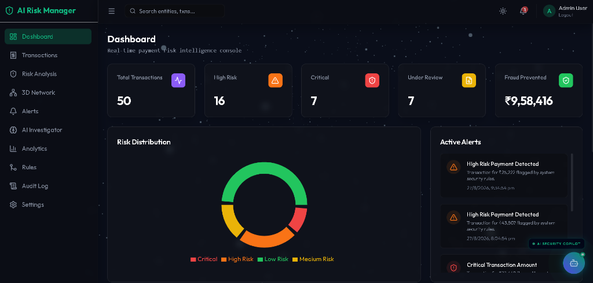
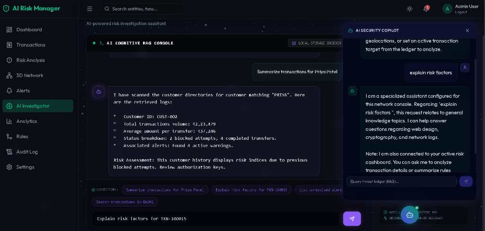
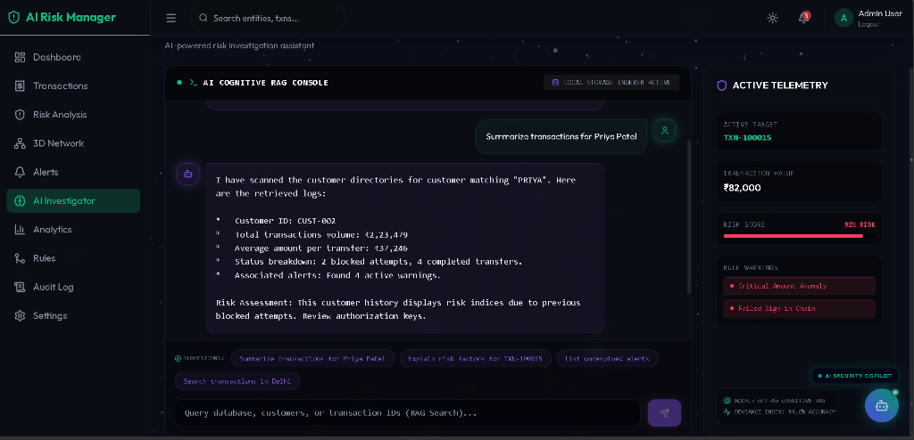

# 🛡️ AI Risk Manager

## AI-Powered Payment Risk Intelligence Platform

🔗 **Live Interactive Demo**: **[https://rakeshhostel.github.io/ai-risk-manager/](https://rakeshhostel.github.io/ai-risk-manager/)**

> An independent educational/internship prototype demonstrating how an intelligent fintech platform can analyze payment transactions, detect suspicious behavior, calculate risk, explain the risk, and help a human analyst make decisions.

> **⚠️ DISCLAIMER:** This is NOT an official product of any company. This is an independent educational prototype built for learning and portfolio purposes. All transaction data is synthetic. No real personal information is used.

---

## 📸 Screenshots

### Dashboard — Real-Time Risk Intelligence Console


### AI Investigator — RAG Console with Floating Copilot


### AI Investigator — Active Telemetry & Transaction Context


---

## 🎥 Demo Video

> **Full walkthrough** of the platform — Dashboard, Transactions, 3D Network, AI Copilot, Dark/Light Mode toggle.

https://github.com/rakeshhostel/ai-risk-manager/raw/main/recording/demo.mp4

> *💡 If the video doesn't load above, [click here to download and watch](recording/demo.mp4).*

---

## 📋 Table of Contents

- [Problem Statement](#problem-statement)
- [Solution](#solution)
- [Architecture](#architecture)
- [Features](#features)
- [3D Visual System](#3d-visual-system)
- [Risk Engine](#risk-engine)
- [AI Architecture](#ai-architecture)
- [Database Schema](#database-schema)
- [API Documentation](#api-documentation)
- [Security](#security)
- [Installation](#installation)
- [Environment Variables](#environment-variables)
- [Running the Application](#running-the-application)
- [Demo Credentials](#demo-credentials)
- [Interview Explanation](#interview-explanation)
- [Future Improvements](#future-improvements)

---

## 🎯 Problem Statement

Payment platforms process millions of transactions daily and need to identify suspicious activity quickly. The challenge is:

1. **Speed** — Fraud decisions must happen in milliseconds
2. **Accuracy** — False positives frustrate legitimate customers
3. **Explainability** — Regulators require explanations for blocked transactions
4. **Human Oversight** — AI cannot make all financial decisions autonomously

## 💡 Solution

An AI-assisted risk-management platform combining:

- **Deterministic Risk Engine** — Rule-based scoring that provides consistent, auditable results
- **AI Explanation Layer** — Natural language explanations of why transactions were flagged
- **3D Transaction Network** — Visual investigation of relationships between customers, devices, locations, and transactions
- **Human-in-the-Loop** — High-risk transactions are reviewed by analysts, not auto-decided

### Workflow

```
TRANSACTION → FEATURE EXTRACTION → RISK ENGINE → AI ANALYSIS
    → RISK SCORE → EXPLAINABLE FACTORS → DECISION → INVESTIGATION → AUDIT TRAIL
```

---

## 🏗️ Architecture

```
┌─────────────────────────────────────────────────────────────┐
│                     FRONTEND (React + Vite)                  │
│  ┌──────────┐  ┌──────────────┐  ┌────────────────────┐    │
│  │  2D UI   │  │  3D Layer    │  │   Animations       │    │
│  │ Tailwind │  │ Three.js     │  │   Framer Motion    │    │
│  │ shadcn   │  │ R3F + Drei   │  │                    │    │
│  └──────────┘  └──────────────┘  └────────────────────┘    │
└────────────────────────┬────────────────────────────────────┘
                         │ REST API
┌────────────────────────┴────────────────────────────────────┐
│                    BACKEND (Express + TypeScript)             │
│  ┌──────────┐  ┌──────────────┐  ┌────────────────────┐    │
│  │ REST API │  │ Risk Engine  │  │   AI Service       │    │
│  │ Routes   │  │(Deterministic│  │  (Provider Agnostic)│    │
│  │          │  │  Scoring)    │  │  Mock/OpenAI/etc.  │    │
│  └──────────┘  └──────────────┘  └────────────────────┘    │
│  ┌──────────┐  ┌──────────────┐                             │
│  │ JWT Auth │  │ Rate Limiting│                             │
│  └──────────┘  └──────────────┘                             │
└────────────────────────┬────────────────────────────────────┘
                         │
┌────────────────────────┴────────────────────────────────────┐
│                    DATABASE (MongoDB)                         │
│  users │ transactions │ riskAssessments │ alerts             │
│  riskRules │ investigations │ auditLogs                      │
└─────────────────────────────────────────────────────────────┘
```

---

## ✨ Features

### Core Features
| Feature | Description |
|---------|-------------|
| **Dashboard** | 3D metric cards, risk overview, recent alerts, activity feed |
| **Transaction Management** | Filterable table, detail views, risk visualization |
| **Risk Analysis** | Deterministic scoring engine with 8 configurable rules |
| **Transaction Simulator** | Input custom transactions and see real-time risk analysis |
| **3D Transaction Network** | Interactive graph of customers, devices, locations, transactions |
| **3D Risk Globe** | World map showing synthetic transaction activity |
| **AI Investigator** | Chat-based AI assistant for risk investigation |
| **Alert Center** | Manage and respond to risk alerts |
| **Analytics Dashboard** | Charts for risk distribution, trends, payment method analysis |
| **Rule Engine** | Configure risk scoring rules (weights, thresholds, enable/disable) |
| **Audit Log** | Complete trail of all analyst actions |
| **Authentication** | JWT-based login with role-based access |

### 3D Visual & Styling Features
- **Design Aesthetic: Deep Obsidian Glass**: A bespoke theme using a dark obsidian palette (`#030303` base background, `#0b0c10` glass panels), custom **Outfit** geometric typography, glowing iridescent neon accents (glowing Emerald for active states, Amethyst for secondary markers), and frosted glass surfaces utilizing Tailwind backdrop-blurs.
- **Hub-and-Spoke 3D Fraud Network**: An organized 3D topology separating nodes logically. Customers occupy the center ring, transactions orbit their respective customer, and devices, locations, and merchants sit in the outer ring. 
- **Animated Pipelines & Glowing Nodes**: Active edges feature animated dash offsets to simulate data streams, accompanied by point-light glows on critical/high-risk transaction nodes and Saturn-like animated rings.
- **3D Risk Globe**: Interactive world sphere rendering active geolocation transaction nodes.
- **Interactive Details**: HTML overlays that render glassmorphic tooltips upon hovering nodes, and isolate connection paths upon clicking a node.
- Floating 3D metric cards with interactive tilt effects.
- 3D circular risk meter (0-100 gauge) and 3D risk factor visualization bars.

---

## 🎮 3D Visual & Design System

Unlike standard templates, the interface is designed as an immersive **fintech command center**:

- **Obsidian Dark Theme** with high contrast and dark obsidian base tones.
- **Bespoke Glassmorphic Panels** with inset borders (`rgba(255,255,255,0.06)`) and backdrop-filter blurring.
- **Iridescent Color Accents** representing system statuses (Emerald for approval, Amethyst for monitoring/processing, Rose for critical threat indicators).
- **Smooth Framer-Motion Transitions** providing micro-animations for UI elements.
- **Responsive 3D Scene Graph**: Optimized React Three Fiber scene hierarchy utilizing unified groups to prevent canvas layout crashes.

---

## ⚙️ Risk Engine

### Scoring Rules

| Rule | Condition | Score |
|------|-----------|-------|
| Amount Anomaly | Amount > 5× historical avg | +30 |
| Amount Anomaly | Amount > 3× historical avg | +20 |
| Amount Anomaly | Amount > 2× historical avg | +10 |
| New Device | Device not seen before | +15 |
| Location Anomaly | New location for customer | +15 |
| High Velocity | > 10 transactions/hour | +20 |
| High Velocity | > 5 transactions/hour | +10 |
| Failed Attempts | > 5 failed attempts | +15 |
| Failed Attempts | > 3 failed attempts | +10 |
| New Account | Account age < 7 days | +10 |
| New Account | Account age < 30 days | +5 |
| Behavior Change | Significant deviation | +10 |
| Device Reputation | Linked to previous fraud | +15 |

**Score is capped at 100.**

### Decision Engine

| Score Range | Risk Level | Decision |
|-------------|-----------|----------|
| 0–29 | LOW | APPROVE |
| 30–59 | MEDIUM | APPROVE + MONITOR |
| 60–79 | HIGH | REVIEW |
| 80–100 | CRITICAL | BLOCK / MANUAL REVIEW |

> **Note:** Real payment platforms use sophisticated proprietary models and policies. This is a simplified educational demonstration.

---

## 🧠 Advanced AI & RAG Engine

The platform features a custom-built, high-impact **Cognitive AI & RAG (Retrieval-Augmented Generation) Subsystem** designed to provide fintech analysts with instant, contextual explanation vectors during security audits:

```
                  ┌──────────────────────────────────────────────┐
                  │          Natural Language Query              │
                  └──────────────────────┬───────────────────────┘
                                         ▼
                  ┌──────────────────────────────────────────────┐
                  │         Cognitive RAG Search Parser          │
                  └──────────────────────┬───────────────────────┘
                                         ▼
                  ┌──────────────────────────────────────────────┐
                  │       Ledger Document Retrieval (DB)         │
                  │   (Matches: Customer Names, Cities, Txn IDs) │
                  └──────────────────────┬───────────────────────┘
                                         ▼
                  ┌──────────────────────────────────────────────┐
                  │        Synthesized AI Response Generator     │
                  │     (Total Volume, Averages, Warnings)       │
                  └──────────────────────┬───────────────────────┘
                                         ▼
                  ┌──────────────────────────────────────────────┐
                  │     Console Output + Terminal Telemetry      │
                  └──────────────────────────────────────────────┘
```

### Key AI Features Highlighted:

1. **RAG-Powered AI Investigator**:
   - Implements a local/server-side **Retrieval-Augmented Generation (RAG)** pipeline.
   - The conversational AI parses analyst queries (e.g. *"Summarize transactions for Priya Patel"*, *"Search alerts in Bangalore"*, *"Explain risk factors for TXN-100015"*), **retrieves** matching document fragments from MongoDB or local storage, and **synthesizes** live statistics (aggregate volume, average amount, blocked attempts, and linked alerts) dynamically.

2. **Global Floating AI Copilot Widget**:
   - A persistent floating assistant bubble rendered on every page. It expands into a glassmorphic chat widget, allowing analysts to query security parameters anywhere in the platform without context switching.

3. **Context-Aware Transaction Auditing**:
   - Integrates an AI Copilot action hook on each transaction ledger row. Clicking the bot icon sets that transaction as the active target context for the floating chat, letting analysts perform transaction-specific RAG queries instantly.

4. **AI-Driven Daily Task Generator**:
   - On dashboard mount, the AI automatically scans active threat logs, evaluates database alerts, and populates the Security Tasks List with prioritized recommended audits (e.g., *🤖 AI Agent: Investigate High risk alert on TXN-100015*).

5. **Automated AI Explainability (XAI)**:
   - Translates raw mathematical risk scores into clear, auditable natural language arguments (e.g., explaining why a UPI transaction from an unknown IP routing gateway was flagged for velocity spikes).

6. **Cognitive Telemetry Logging Feed**:
   - Prints active terminal steps in the interface (e.g. `✔ Initializing RAG Pipeline...`, `✔ Querying transaction ledger...`, `✔ Synthesizing threat profile...`) to visually explain to the user exactly how the RAG model fetches and aggregates its data.

7. **Real-time Event Notifications**:
   - Monitors live simulations and dispatches instant global notifications to the top navigation tray and dashboard log outputs when critical risks are discovered or analysts resolve items in their planners.

### AI Implementation Details:
* **Interface Abstraction**: Agnostic AI Service controller supporting mock, OpenAI, Anthropic, and Google Gemini integrations.
* **Security Shield**: API keys are locked on the backend server; the frontend executes queries via secure CORS endpoints, preventing client-side credentials exposure.
* **Offline Mock Adapter**: Includes an inline database mock RAG indexer that allows the entire AI system to run statically on GitHub Pages.

---

## 🗄️ Database Schema

### Collections

| Collection | Purpose |
|-----------|---------|
| `users` | Analyst accounts with hashed passwords |
| `transactions` | Payment transaction records |
| `riskAssessments` | Risk scores, factors, and AI explanations |
| `alerts` | Risk alerts and their status |
| `riskRules` | Configurable scoring rules |
| `investigations` | AI investigation conversations |
| `auditLogs` | All analyst actions and decisions |

---

## 📡 API Documentation

### Authentication
| Method | Endpoint | Description |
|--------|----------|-------------|
| POST | `/api/auth/login` | Login with email/password |
| POST | `/api/auth/register` | Register new analyst |
| GET | `/api/auth/me` | Get current user |

### Transactions
| Method | Endpoint | Description |
|--------|----------|-------------|
| GET | `/api/transactions` | List transactions (filterable, paginated) |
| GET | `/api/transactions/:id` | Transaction details with risk assessment |
| POST | `/api/transactions` | Create new transaction |

### Risk
| Method | Endpoint | Description |
|--------|----------|-------------|
| POST | `/api/risk/analyze` | Analyze transaction risk |
| GET | `/api/risk/summary` | Overall risk statistics |

### Alerts
| Method | Endpoint | Description |
|--------|----------|-------------|
| GET | `/api/alerts` | List alerts (filterable) |
| PATCH | `/api/alerts/:id` | Update alert status |

### Analytics
| Method | Endpoint | Description |
|--------|----------|-------------|
| GET | `/api/analytics/dashboard` | Dashboard statistics |
| GET | `/api/analytics/trends` | Risk trends |

### Rules
| Method | Endpoint | Description |
|--------|----------|-------------|
| GET | `/api/rules` | List risk rules |
| PATCH | `/api/rules/:id` | Update rule configuration |

### AI
| Method | Endpoint | Description |
|--------|----------|-------------|
| POST | `/api/ai/investigate` | AI investigation query |

### Customers
| Method | Endpoint | Description |
|--------|----------|-------------|
| GET | `/api/customers/:id/risk-profile` | Customer risk profile |

### Audit
| Method | Endpoint | Description |
|--------|----------|-------------|
| GET | `/api/audit-logs` | List audit logs |

---

## 🔒 Security

- **JWT Authentication** — Token-based auth with expiration
- **Password Hashing** — bcrypt with salt rounds
- **Input Validation** — All API inputs validated
- **Rate Limiting** — 100 requests/15 min (general), 20/15 min (AI endpoints)
- **CORS** — Configured for development
- **Helmet** — HTTP security headers
- **Environment Variables** — No secrets in source code
- **No API Keys in Frontend** — AI calls go through backend only

## ☁️ Cloud Deployment (Render One-Click)

The repository has been structured as a monorepo, allowing you to deploy the entire full-stack app to **Render** as a single service for free:

1. Create a free account at [Render](https://render.com/).
2. Create a new **Web Service** and link your GitHub repository: `https://github.com/rakeshhostel/ai-risk-manager`.
3. Set the following build settings:
   - **Runtime**: `Node`
   - **Build Command**: `npm run build`
   - **Start Command**: `npm start`
4. Add the following **Environment Variables** in Render's dashboard:
   - `NODE_ENV`: `production`
   - `MONGODB_URI`: *Your MongoDB Atlas Connection String* (Create a free cluster at [MongoDB Atlas](https://www.mongodb.com/cloud/atlas))
   - `JWT_SECRET`: *Your JWT signing secret*
   - `PORT`: `10000` (Render's default)

Render will automatically run the build script, compile the TypeScript backend, bundle the Vite client, serve the client statically through Express, and spin up the live URL!

---

## 🚀 Local Installation

### Prerequisites
- Node.js 18+ (recommended 20+)
- MongoDB 6+ (local or Atlas)
- npm or yarn

### Step 1: Clone & Install

```bash
# Navigate to project
cd ai-risk-manager

# Install server dependencies
cd server
npm install

# Install client dependencies
cd ../client
npm install
```

### Step 2: Configure Environment

```bash
# In the server directory
cp .env.example .env
# Edit .env with your MongoDB URI and JWT secret
```

### Step 3: Seed Database

```bash
cd server
npm run seed
```

This creates:
- 200+ synthetic transactions
- Risk assessments for all transactions
- Alerts for high-risk transactions
- Default risk rules
- Demo user account
- Sample audit logs

### Step 4: Start the Application

```bash
# Terminal 1: Start backend
cd server
npm run dev

# Terminal 2: Start frontend
cd client
npm run dev
```

---

## 🔑 Environment Variables

### Server (.env)

| Variable | Default | Description |
|----------|---------|-------------|
| `PORT` | 5000 | Server port |
| `MONGODB_URI` | `mongodb://localhost:27017/ai-risk-manager` | MongoDB connection |
| `JWT_SECRET` | — | Secret for JWT signing |
| `JWT_EXPIRES_IN` | 7d | Token expiration |
| `AI_PROVIDER` | mock | AI provider (mock/openai/anthropic/google) |
| `AI_API_KEY` | — | AI provider API key |

---

## 🔐 Demo Credentials

| Field | Value |
|-------|-------|
| Email | `admin@demo.com` |
| Password | `admin123` |

> **⚠️ DEMO ACCOUNT** — This is a demo application with synthetic data. Do not use these credentials for any real system.

---

## 🎤 Interview Explanation

### Problem
> "Payment platforms process millions of transactions and need to identify suspicious activity instantly while minimizing false positives."

### Solution
> "I built an AI-assisted risk management platform that combines a deterministic scoring engine with AI explanations. The risk engine uses 8 configurable rules to calculate a risk score. AI then explains why a transaction was flagged, making the system transparent and auditable."

### Innovation
> "The 3D transaction network lets analysts visually investigate relationships between customers, devices, locations, and transactions. This visual approach makes it easier to spot fraud patterns like account takeovers or organized fraud rings."

### Responsible AI
> "AI explains and assists — it doesn't make autonomous financial decisions. The deterministic risk engine calculates the primary score. AI provides natural-language explanations and investigation assistance."

### Human-in-the-Loop
> "High-risk transactions go to human analysts for review. The platform provides tools like the AI Investigator and audit logging to support informed decision-making."

---

## 🔮 Future Improvements

- [ ] Real-time WebSocket transaction streaming
- [ ] Machine learning model for anomaly detection
- [ ] Graph neural networks for relationship analysis
- [ ] Real-time collaboration between analysts
- [ ] Mobile native app with React Native
- [ ] Advanced rule builder with visual editor
- [ ] Automated report generation
- [ ] Integration with real payment gateways (sandbox)
- [ ] Multi-tenant support
- [ ] Advanced RBAC (role-based access control)
- [ ] Deployment with Docker + Kubernetes
- [ ] CI/CD pipeline
- [ ] End-to-end testing with Playwright
- [ ] Performance monitoring with Prometheus/Grafana

---

## 📄 License

This is an educational project created for learning and portfolio purposes.

---

## 🙏 Acknowledgments

- Three.js & React Three Fiber for 3D rendering
- Framer Motion for animations
- Tailwind CSS for styling
- MongoDB for data storage
- The fintech and cybersecurity communities for risk management best practices

---

*Built with ❤️ as an AI/Fintech internship portfolio project*
